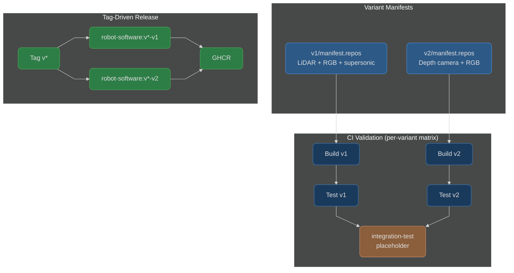

# Product Manifest

[](https://github.com/calebjakemossey/product-manifest/actions/workflows/validate.yaml)

Coordinates product releases across packages, defines hardware variants, and produces deployment artefacts. This repository is the single source of truth for what software runs on each robot.

## Architecture



## How It Works

**Variant manifests** define which packages at which versions compose each hardware configuration. Each variant lives in its own directory under `variants/`, containing a `manifest.repos` file (a standard [vcstool](https://github.com/dirk-thomas/vcstool) manifest), a `config/` directory, and a `README.md`.

**Pull requests** that bump package versions trigger CI, which builds and tests the full workspace for every variant. The build matrix is discovered automatically from directories containing `manifest.repos` - adding a new variant directory is all that is needed to include it in validation.

**Tagging** the manifest triggers the release workflow, which parses the tag to determine what to build:

- `v2.1.0` - builds and pushes deployment images for **all** variants
- `v2.1.0-v1` - builds and pushes only the **v1** variant image
- `v2.1.0-v2` - builds and pushes only the **v2** variant image

A GitHub Release is created automatically with Docker pull commands for each variant built and a package versions table extracted from the manifests.

## Asynchronous Development

Teams develop and release packages independently in their own repositories. Each package has its own CI pipeline, versioning, and release cadence.

The manifest coordinates which versions compose each product release. A package team does not need to know about hardware variants - they simply publish versioned releases. The product team then updates the manifest to pull in tested, compatible versions.

This decoupling means:
- Package teams ship at their own pace
- The manifest is the single source of truth for what runs on each robot
- Version bumps are explicit, reviewable PRs

## Variant Structure

```
variants/
  v1/
    manifest.repos        # Package manifest for v1 hardware
    config/               # v1-specific configuration (model weights, calibration, launch profiles)
    README.md             # v1 variant documentation
  v2/
    manifest.repos        # Package manifest for v2 hardware
    config/               # v2-specific configuration
    README.md             # v2 variant documentation
```

Each variant is a self-contained directory. Adding a new variant means creating a new directory with a `manifest.repos`, `config/`, and `README.md` - the CI and release workflows discover it automatically.

## Cutting a Release

### Full Product Release (All Variants)

1. Open a PR bumping package versions in the relevant `manifest.repos` files
2. CI validates the build for all affected variants
3. Merge the PR
4. Tag the merge commit: `git tag v2.1.0 && git push origin v2.1.0`
5. The release workflow builds and pushes deployment images for **all** variants to GHCR

### Selective Variant Release

To release only a single variant, append the variant name as a tag suffix:

```bash
git tag v2.1.0-v1 && git push origin v2.1.0-v1   # releases only v1
git tag v2.1.0-v2 && git push origin v2.1.0-v2   # releases only v2
```

This is useful when a change only affects one hardware configuration and you want to avoid rebuilding unrelated variants.

### Re-pushing a Tag

If a release needs to be rebuilt (e.g. after a hotfix to the release workflow), delete and re-push the tag:

```bash
git tag -d v2.1.0 && git push origin :refs/tags/v2.1.0
git tag v2.1.0 && git push origin v2.1.0
```

This overwrites the existing image(s) in GHCR.

## Contributing

See [CONTRIBUTING.md](CONTRIBUTING.md) for guidelines on bumping versions, adding variants, and cutting releases.
