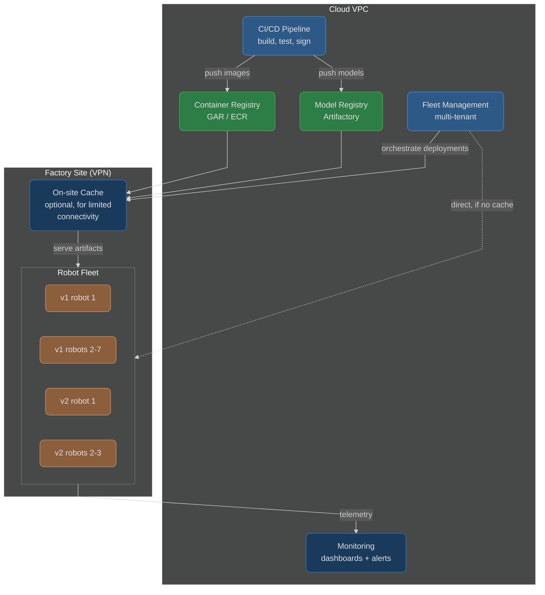
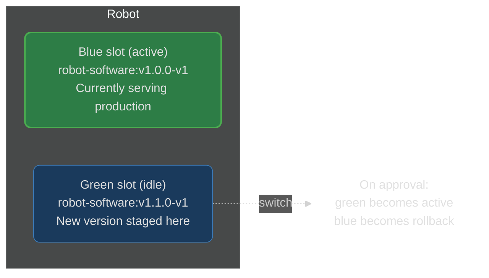
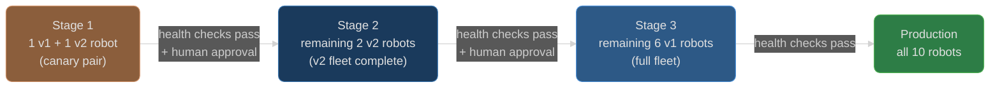
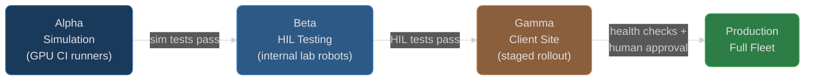
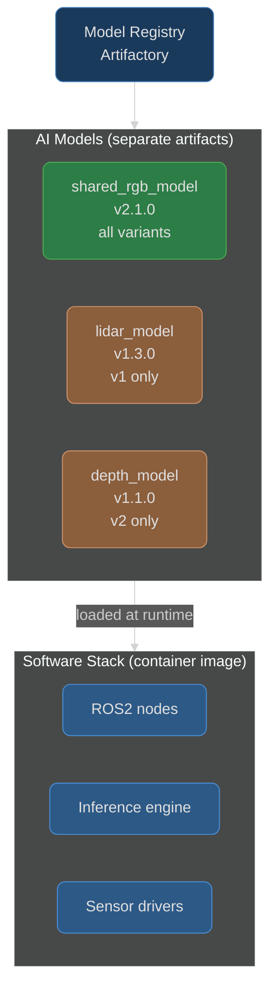
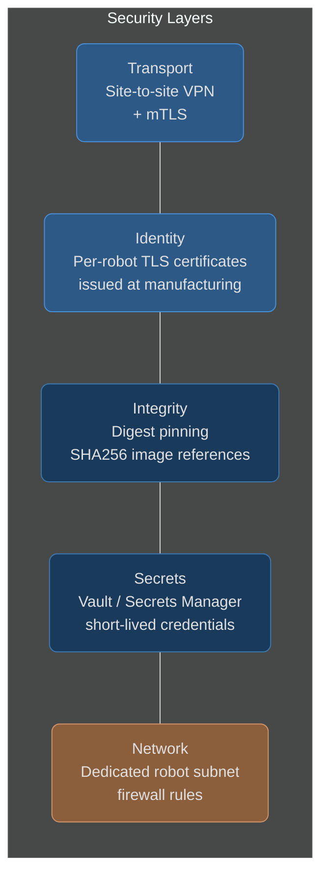
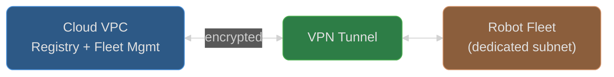
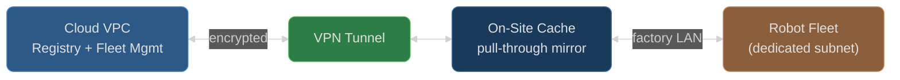
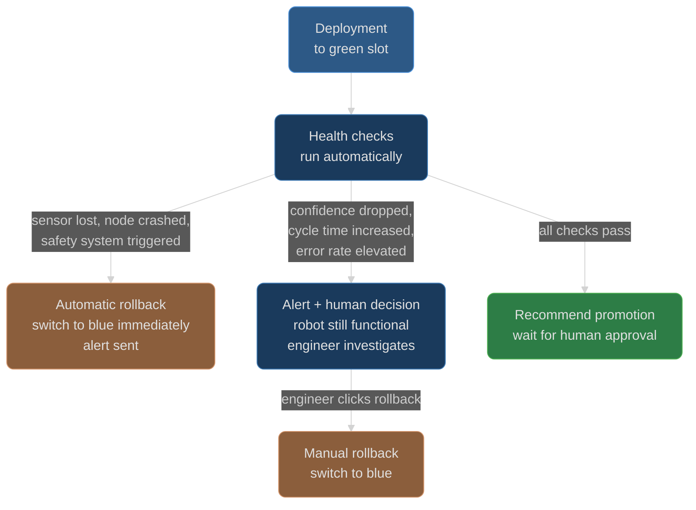
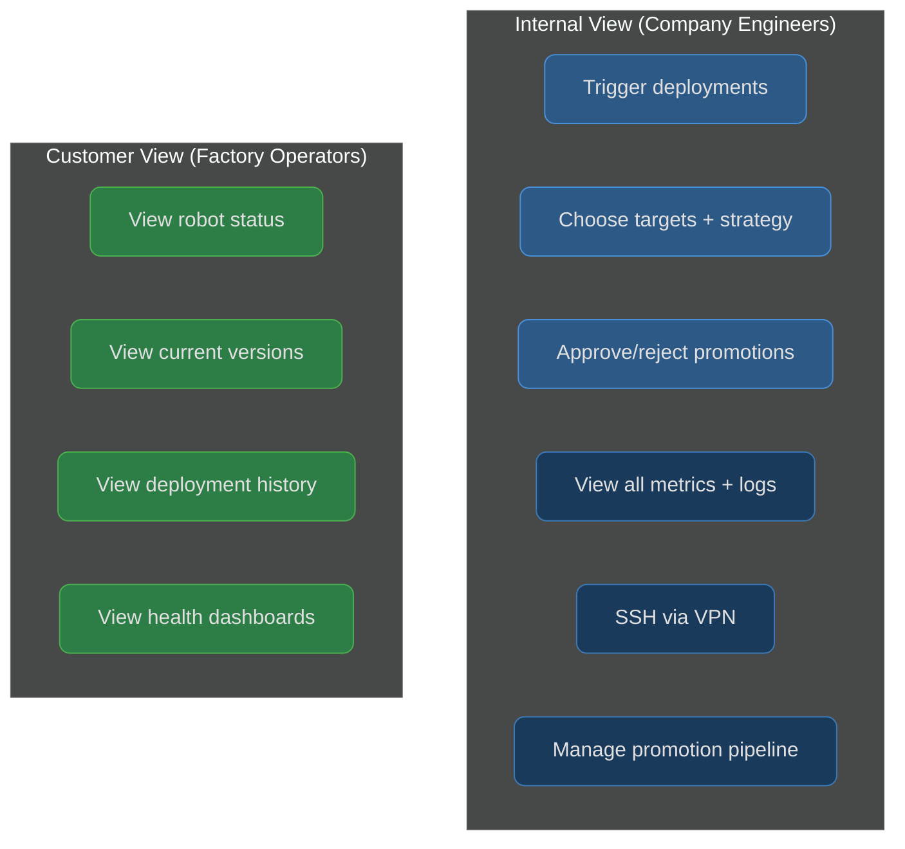

# Hybrid Fleet Deployment

## Table of Contents

- [Foundation: Challenge 1 Artifacts](#foundation-challenge-1-artifacts)
- [Scenario](#scenario)
- [Design Approach](#design-approach)
- [Architecture Overview](#architecture-overview)
- [Deployment Strategy](#deployment-strategy)
- [Promotion Pipeline](#promotion-pipeline)
- [Model Deployment](#model-deployment)
- [Security Architecture](#security-architecture)
- [Network Infrastructure](#network-infrastructure)
- [Monitoring and Rollback](#monitoring-and-rollback)
- [Fleet Management System](#fleet-management-system)

---

## Foundation: Challenge 1 Artifacts

This document builds directly on the CI/CD pipeline implemented in [Challenge 1](overview.md). That work produced a working system for building, testing, and releasing variant-aware software for a hybrid robot fleet. The key artifacts it provides are:

- **Per-variant manifests** ([product-manifest](https://github.com/calebjakemossey/product-manifest)) - each hardware variant (v1, v2) has its own `manifest.repos` file pinning exact package versions. This is the single source of truth for what software runs on each robot class.
- **Tag-driven variant releases** - tagging the manifest produces per-variant Docker images automatically. `v1.0.0` builds all variants; `v1.0.0-v1` builds only v1. Images are pushed to a container registry with a [GitHub Release](https://github.com/calebjakemossey/product-manifest/releases/tag/v1.0.0) listing a bill of materials for each variant.
- **CI validation per variant** - every version bump PR triggers a build matrix that validates the full workspace for each variant independently before merge. A bad version combination is caught before it can be released.
- **Shared release workflow** ([ci-workflows](https://github.com/calebjakemossey/ci-workflows)) - a reusable workflow that builds Docker images and creates GitHub Releases for individual packages, used by repos like [assignment_example_ros_pkg](https://github.com/calebjakemossey/assignment_example_ros_pkg/releases/tag/v1.0.1).

Challenge 1 answers the question: "how do we build and validate software for multiple hardware variants?" This document answers the next question: **"how do we get that software onto robots in a factory, safely, securely, and at scale?"**

The CI/CD pipeline produces versioned, variant-aware container images. This document designs the system that consumes those images - orchestrating their deployment across a fleet of robots with different hardware, managing the rollout strategy, handling AI models independently, securing the entire pipeline, and providing the monitoring needed to know whether a deployment succeeded.

---

## Scenario

A factory client site runs 10 robots across two hardware configurations:

| Variant | Count | Sensors | Models Required |
|---------|-------|---------|-----------------|
| v1 | 7 | RGB cameras, LiDAR, supersonic | Shared RGB model + LiDAR-specific model |
| v2 | 3 | RGB cameras, depth camera | Shared RGB model + depth camera-specific model |

We are releasing a new AI capability that requires deploying models to the entire fleet simultaneously. The shared RGB model goes to all robots. Each variant also receives a sensor-specific model that performs the same task using different hardware.

The company controls the machines and can decide when updates are applied. Downtime at the factory has real cost to the client.

### Key Challenges

This scenario presents several challenges that shape every decision in this document:

1. **Hardware heterogeneity** - two robot variants with different sensor configurations require different software and models. A deployment system that treats the fleet as uniform will deploy the wrong software to the wrong robot.

2. **Factory downtime cost** - these robots are automating a manufacturing process. A failed deployment that takes a robot offline directly impacts the client's production line. The deployment strategy must minimise blast radius and provide instant rollback.

3. **Simultaneous but safe** - we need to deploy to the entire fleet, but "simultaneously" cannot mean "all at once with no safety net." The system must balance speed of rollout with confidence that the new software works.

4. **Decoupled release cadences** - AI models iterate at a different rate ot the software stack. The robotics team and the AI team should not block each other. Models and software need independent deployment lifecycles.

5. **Multiple client sites (future)** - this is the first deployment, but the architecture should support multiple factory sites with different variant mixes, different network conditions, and different update schedules.

6. **Startup pragmatism** - the solution must be implementable by a small team. Over-engineering is as much a risk as under-engineering.

---

## Design Approach

This section explains the reasoning behind the core architectural choices before presenting the detailed designs.

### Why Blue/Green Deployment

In a factory environment where downtime has direct cost, the deployment mechanism must support **instant rollback**. If a new version causes a robot to malfunction, switching back to the previous working version must take seconds, not minutes.

Blue/green deployment achieves this by maintaining two deployment slots on each robot. The active slot runs the current production software. The idle slot receives the new version. Switching between them is a container stop/start operation. This is fundamentally different from a rolling update where the old version is replaced in-place - with blue/green, the old version is always available to switch back to.

We combine blue/green with a **staged rollout** rather than deploying to all 10 robots simultaneously. The rollout proceeds in stages (a canary pair first, then expanding), with health checks and human approval gating each stage. This limits the blast radius of a bad deployment - if the canary fails, only 2 robots are affected, not 10.

### Why a Four-Stage Promotion Pipeline

A release should not reach a client's robots until it has been validated in progressively more realistic environments. The four stages - alpha (simulation), beta (hardware-in-the-loop), gamma (client site staged rollout), and production - create a funnel where issues are caught as early as possible:

- **Alpha** catches software bugs and regression failures in simulation - cheap and fast, no hardware required
- **Beta** catches hardware-specific issues that simulation misses - real sensors, real timing, real noise, but on internal test robots where a failure has no client impact
- **Gamma** is the first time the software runs at a client site - staged rollout ensures only a fraction of the fleet is affected if something was missed
- **Production** is reached only after all prior stages have passed

Each stage is more expensive and slower than the last, which is why the earlier stages exist - to catch issues before they require the expensive validation.

### Why Models Deploy Independently

The AI team trains and validates models on a different cadence from the software team. A new RGB model might be ready every week, whilst the software stack releases monthly. If models are bundled into the software image, every model update requires a full software deployment cycle. Separating them means:

- The AI team ships models without waiting for a software release
- The software team ships code without re-deploying models
- Each artifact is smaller and faster to deploy
- Rollback is granular - a bad model can be reverted without touching the software stack

### Why Multi-Tenant Fleet Management

The fleet management system is the single interface for all deployment operations. It must serve two audiences with different needs:

- **Internal engineers** need full control: trigger deployments, choose targets, approve promotions, inspect metrics, access robots remotely
- **Factory clients** need visibility: what version is running, whether a deployment is in progress, whether their fleet is healthy

Building this as a multi-tenant system from the start avoids the common pattern of building an internal tool first and then scrambling to build a customer-facing version later. Both views are backed by the same data - the customer view simply exposes a read-only subset.

---

## Architecture Overview

The system is split between a cloud-hosted control plane and the factory site, connected via VPN. The cloud hosts all orchestration, storage, and monitoring. The factory site contains the robots and optionally an artifact cache for sites with limited connectivity.

The cloud VPC hosts all control infrastructure: CI/CD, artifact registries, fleet management, and monitoring. The factory site connects via VPN. Robots pull software and models from a local cache (or directly from the cloud where connectivity permits). Telemetry flows back to the cloud for dashboards and alerting.

---

## Deployment Strategy

### Blue/Green with Staged Rollout

The deployment mechanism centres on two ideas: blue/green slots for instant rollback, and staged rollout for blast radius control. Together they ensure that a bad deployment can be reversed in seconds and that at most a small fraction of the fleet is affected before the issue is caught.

Each robot maintains two deployment slots:

- **Blue** is the active slot running production software
- **Green** is idle, where a new version is staged and validated before becoming active
- **Switching** is near-instant - stop one container, start the other
- **Rollback** is equally instant - switch back to blue

### Staged Rollout

Deployments do not go to the full fleet at once. The rollout is staged to limit blast radius:

Each stage goes through the full blue/green cycle: pull new image into green slot, run automated health checks, wait for human approval, then switch.

### Switch Trigger: Semi-Automated

- **If health checks fail**: automatic rollback, no human required. The robot switches back to blue immediately and an alert is sent.
- **If health checks pass**: the system recommends the switch but **waits for human approval** before committing.

This is appropriate for a first deployment at a client site - automated safety nets with human judgment for go-live. As confidence grows, the approval gate can be removed.

---

## Promotion Pipeline

Every release - whether software or AI model - must prove itself in progressively more realistic environments before it reaches a customer's robots. This is not just a testing strategy; it is the mechanism by which we build confidence that a release is safe to deploy. Each stage is more expensive and more realistic than the last, which is why the earlier stages exist - to catch issues cheaply before they require expensive real-world validation.

Software and models move through four stages before reaching a customer's fleet:

| Stage | Environment | What happens | Gate to promote |
|-------|-------------|-------------|-----------------|
| **Alpha** | Simulation (Gazebo/Isaac Sim on GPU runners) | Full-stack tests with simulated sensors and environments. Automated. | Sim tests pass |
| **Beta** | Internal lab (company-owned test robots) | Hardware-in-the-loop testing on real sensors. First contact with real hardware. Internal only - no customer involvement. | HIL tests pass |
| **Gamma** | Client site (staged blue/green rollout) | Canary pair first, then remaining fleet in stages. Real production environment with real workloads. | Health checks + human approval per stage |
| **Production** | Full customer fleet | Proven software, promoted after gamma completes. Active blue slot. | Gamma completed successfully |

### Customer-Scoped Releases

Not every release goes to every customer. The promotion pipeline runs independently per customer site:

- A release can be in production for Customer A whilst still in beta for Customer B
- Different customers can run different software versions without blocking each other
- The fleet management system tracks promotion status per customer

This is important because different client sites may have different hardware revisions, different operational requirements, or different schedules for accepting updates.

### Per-Robot-Cell Versioning

Each robot tracks its own version independently. During staged rollout, different robots legitimately run different versions. A specific robot can be held on an older version if needed (hardware issue, customer request). The fleet management system tracks per robot: ID, variant, customer, current software version, current model versions, deployment history, and health status.

---

## Model Deployment

In this scenario, we are deploying new AI models to a fleet that already has a working software stack. The AI team and the software team work at different speeds - models may be retrained and updated weekly, whilst the core software stack releases less frequently. Coupling these two lifecycles would force one team to wait for the other, slowing both down.

The solution is to treat AI models as independent artifacts that sit on top of the software stack. The software provides the runtime (ROS2 nodes, inference engine, sensor drivers); models are loaded at runtime from a separate artifact store. This allows each team to release on their own cadence without coordination overhead.

### Why Separate Deployment

- **Different cadence**: the AI team iterates on models faster than the software team releases code. Coupling them forces one team to wait for the other.
- **Different artifacts**: model files (.onnx, .pt, .tflite) are large (hundreds of MB to several GB). Keeping them out of the software image keeps image sizes lean.
- **Different owners**: the AI team owns model quality, the software team owns runtime quality. Independent deployment respects these ownership boundaries.

### Model Promotion

Models follow the same four-stage pipeline (alpha -> beta -> gamma -> production) independently from software. A new RGB model can be deployed to the fleet without touching the software stack. A software update can be deployed without re-deploying models.

### Fleet Management Tracking

The fleet management system tracks both software and model versions per robot:

| Robot | Variant | Software | RGB Model | Sensor Model | Status |
|-------|---------|----------|-----------|--------------|--------|
| v1-001 | v1 | v1.0.0-v1 | v2.1.0 | lidar v1.3.0 | healthy |
| v1-002 | v1 | v1.0.0-v1 | v2.1.0 | lidar v1.3.0 | healthy |
| v2-001 | v2 | v1.0.0-v2 | v2.1.0 | depth v1.1.0 | healthy |

---

## Security Architecture

Robotics deployments handle proprietary algorithms, trained models, and sensor data from client environments. The security architecture must protect these assets at every stage - from the CI pipeline that builds the software, through the network that delivers it, to the robots that run it. Rather than relying on a single security mechanism, the approach is defence in depth: multiple independent layers, each addressing a different threat vector. A failure in one layer does not compromise the system.

Security is layered across five areas:

### Robot Identity (mTLS)

Each robot receives a unique TLS client certificate at manufacturing time, issued by a private CA managed by the company. This certificate is the robot's identity.

- **Issued** at manufacturing, backed up in cloud secrets management (Vault, GCP Secret Manager, AWS Secrets Manager)
- **Expiry** after a defined period with a grace window for automated renewal
- **Hard termination** after the grace window - the robot can no longer authenticate and requires manual intervention to re-certify
- This forced expiry is a security guarantee: decommissioned, lost, or compromised robots eventually lose access without any action required

### Transport Encryption

- **Site-to-site VPN** between the factory and cloud VPC - all traffic encrypted at the network level
- **mTLS** on top for service-level authentication - the VPN encrypts the tunnel, mTLS authenticates both ends
- **VPN on individual robots** for remote access (SSH, diagnostics) by the DevOps team - a support channel, not required for core robot operation

### Artifact Integrity

- **Digest pinning** - the fleet management system instructs robots to pull specific image digests (SHA256), not mutable tags. Tags can be overwritten; digests cannot. This guarantees the robot gets exactly the image that was tested and approved.
- **Image signing** (e.g. cosign/Sigstore) is available as an additional layer but is lower priority given artifacts originate from within private infrastructure.

### Network Segmentation

Robots are deployed on a **dedicated subnet** within the factory network. This is both a security and a functional requirement: ROS2 uses DDS for communication, which performs multicast discovery by default. Without network isolation, DDS discovery traffic floods the entire network - a known operational issue in ROS2 deployments. The dedicated subnet contains this traffic.

Robot network access is restricted to:
- The artifact store (cloud or local cache)
- The fleet management system
- The monitoring/telemetry endpoint
- VPN endpoint (for remote access)

All other traffic is blocked by firewall rules.

---

## Network Infrastructure

Factory environments vary widely in their network infrastructure. Some have reliable high-bandwidth internet; others have limited or intermittent connectivity. The deployment system must work in both situations without requiring the client to change their network. Rather than mandating a single topology, the architecture supports two options, chosen per client site based on their connectivity:

### Topology A: Direct Cloud Access

For sites with reliable internet. Robots pull artifacts directly from the cloud registry over the VPN.

### Topology B: On-Site Cache

For sites with limited connectivity. A lightweight on-site server caches artifacts locally. The image is pulled from the cloud once and served to all robots over the factory LAN.

The choice is per-site, not global. The fleet management system abstracts the topology - the deployment interface is identical regardless of how artifacts reach the robots.

---

## Monitoring and Rollback

Deploying software is only half the problem. The other half is knowing whether the deployment worked. Without robust monitoring and fast rollback, a blue/green deployment is just a mechanism - the intelligence that makes it safe comes from the metrics that feed the switch decision and the automated responses when those metrics indicate a problem.

### Telemetry

Robots generate telemetry continuously. The transport adapts to network conditions - streaming where bandwidth allows, buffering and batching where it does not:

| Data type | Transport | Examples |
|-----------|-----------|---------|
| Streaming | Direct to cloud when connectivity allows | Video feeds, live sensor data |
| Batched | Buffered on-robot or on-site collector, uploaded in batches | System metrics, inference latency, task rates |
| Events | Buffered, uploaded when possible | ROS logs, deployment events, errors |

In network-limited environments, an on-site collector buffers telemetry from all robots over the factory LAN and uploads to the cloud when bandwidth is available. Robots are never blocked waiting for a cloud upload, and no telemetry is lost during connectivity gaps.

### Health Check Metrics

| Category | Metrics |
|----------|---------|
| System health | CPU, memory, disk, GPU utilisation, process alive |
| Sensor health | Camera feed active, LiDAR returning data, depth camera connected |
| Model inference | Latency per frame, success rate, confidence scores |
| Task performance | Cycle time, completion rate, error/retry rate |
| ROS health | Node status, topic publish rates, service response times |

### Rollback Triggers

- **Automatic rollback** (no human required): sensor feed lost, ROS nodes crashed, inference engine unresponsive, safety system triggered. The robot switches back to the previous slot immediately.
- **Alert + human decision**: performance degradation where the robot is still functional. Metrics are surfaced; an engineer investigates and can trigger a one-click rollback from the fleet management dashboard.
- **Manual rollback**: available at any time. An engineer inspects metrics and clicks "rollback" to switch any robot to its previously active slot.

Software and model rollbacks are independent - a model regression does not require rolling back the software stack, and vice versa.

---

## Fleet Management System

Every design decision in this document - blue/green slots, staged rollouts, promotion pipelines, health checks, rollback triggers - requires an interface where humans make decisions and inspect state. The fleet management system is that interface. It is the single point where an engineer triggers a deployment, approves a promotion, inspects a robot's health, or clicks "rollback." It is also where the factory client sees what is running on their robots, providing transparency without exposing internal process.

### Multi-Tenant Design

- **Internal view**: full deployment control - trigger deployments, choose targets (individual robots, variant groups, canary pairs, full fleet), choose strategy (blue/green staged rollout), monitor health checks in real-time, approve or reject promotions, access logs, SSH to robots via VPN
- **Customer view**: read-only visibility into their own fleet - robot status, current software and model versions, deployment history, health dashboards. Gives the client transparency and confidence without exposing internal tooling

### What It Tracks Per Robot

| Field | Example |
|-------|---------|
| Robot ID | v1-001 |
| Variant | v1 |
| Customer site | Factory Alpha |
| Software version | robot-software:v1.0.0-v1 |
| RGB model version | shared_rgb v2.1.0 |
| Sensor model version | lidar v1.3.0 |
| Blue/green slot status | blue active, green idle |
| Health status | healthy |
| Last deployment | 2026-03-28 14:30 UTC |
| Deployment history | Full audit trail |

