# CI/CD Pipeline: Solution Overview

## Table of Contents

- [Introduction](#introduction)
- [Requirements Coverage](#requirements-coverage)
- [Architecture Overview](#architecture-overview)
- [Developer Flow](#developer-flow)
- [CI Pipeline Design](#ci-pipeline-design)
- [Package Release](#package-release)
- [Cross-Repo Dependency Management](#cross-repo-dependency-management)
- [Product Manifest and Hardware Variants](#product-manifest-and-hardware-variants)
- [Contribution Rules](#contribution-rules)
- [End-to-End Verification](#end-to-end-verification)
- [Beyond the Brief](#beyond-the-brief)
- [Divergences from Assignment Requirements](#divergences-from-assignment-requirements)
- [Future Improvements](#future-improvements)
- [Pipeline Links](#pipeline-links)

## Introduction

This solution implements a CI/CD pipeline for a multi-repository robotics software stack, built across four repositories that separate concerns between shared infrastructure, individual packages, and product-level coordination. Each application repository owns its own CI workflow inline - self-contained definitions for linting and testing that require no external workflow references. A shared infrastructure repository provides Docker images for the ROS2 build environment and a reusable release workflow for building deployable artefacts. A product manifest repository sits above the individual packages, defining which versions compose each hardware variant and validating that those combinations actually build and pass tests together. This keeps CI fast and independently evolvable per repo, whilst centralising the release process and providing a single source of truth for what runs on the robots.

The four repositories:

- [ci-workflows](https://github.com/calebjakemossey/ci-workflows) - shared CI infrastructure (Docker images, generic release Dockerfile, reusable release workflow)
- [assignment_example_pkg](https://github.com/calebjakemossey/assignment_example_pkg) - Python library with pytest-based tests (tagged v1.0.0)
- [assignment_example_ros_pkg](https://github.com/calebjakemossey/assignment_example_ros_pkg) - ROS2 workspace with message definitions and node packages (tagged v1.0.0)
- [product-manifest](https://github.com/calebjakemossey/product-manifest) - hardware variant definitions, product-level validation, and deployment image releases

## Requirements Coverage

### Challenge 1: Setting Up a Robotics CI Pipeline

| Requirement | How It Is Addressed |
|---|---|
| CI pipeline for both repos | Each repo owns an inline CI workflow. The Python repo runs flake8 + pytest across three Python versions. The ROS2 repo runs ament linters, then builds and tests in a custom `ros-ci:humble` container. Both pipelines are sequential - lint gates build/test to prevent wasted compute on code that fails style checks. |
| "Assume more repos" | The shared release workflow (`release.yaml`) and generic `Dockerfile.release` in ci-workflows scale to N repos - adding a new package requires only a thin caller workflow. The product manifest coordinates version composition across all packages. |
| "May require GPUs/simulators" | The product manifest includes a placeholder `integration-test` job showing where GPU-accelerated simulation tests slot in. The [Future Improvements](#future-improvements) section describes a tiered runner architecture for GPU workloads. |
| "Repos updated independently, API changes" | vcstool pinning in `workspace.repos` files ensures each repo builds against known-good dependency versions. Version bump PRs trigger normal CI, verifying compatibility before merge. The manifest validates full product combinations across variants. |
| Contribution rules | Every repository includes CONTRIBUTING.md, PR templates, CODEOWNERS, and branch protection. Rules are summarised in the [Contribution Rules](#contribution-rules) section below. |
| Deliverable: overview report | This document. |
| Deliverable: file listing | [files.md](files.md) - complete list of all added files across all four repos. |
| Deliverable: access instructions | [access.md](access.md) - repository URLs, CI pipeline links, Docker image pull commands, and demo PR links. |

### Challenge 3: Hybrid Fleet Deployment (Partial)

The product manifest repository addresses the fleet composition aspect of Challenge 3 - defining which software versions run on which hardware variant and producing per-variant deployment images.

| Requirement | How It Is Addressed |
|---|---|
| Deployment strategy across hybrid fleet | Per-variant manifest files define the software composition for each hardware configuration. Tag-driven releases produce Docker images per variant, ready for deployment to the correct robot class. |
| Per-robot-cell software versioning | Each variant's `manifest.repos` pins exact package versions. Selective variant releases (`v2.1.0-v1`) allow deploying to one hardware class without rebuilding others. |
| Split between development, testing, and production | Package CI (per-repo) validates individual changes. Manifest CI validates cross-package compatibility per variant. Tag-driven releases produce immutable deployment artefacts. |

## Architecture Overview

The following diagram shows how the four repositories relate to each other. ci-workflows provides the Docker CI image and shared release workflow. The ROS2 repo calls the shared release workflow when tagged. The product manifest sits above everything, coordinating which package versions compose each hardware variant and producing the final deployment images.

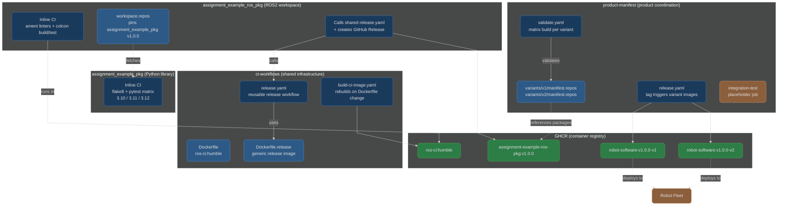

### Repository Roles

**ci-workflows** is the shared infrastructure layer. It owns the `ros-ci:humble` Docker image (built automatically when the Dockerfile changes), a generic `Dockerfile.release` that works with any ROS2 repository, and the reusable `release.yaml` workflow that individual repos call when tagged. The shared release workflow also creates a GitHub Release with Docker pull instructions. This separation means build tooling evolves independently from application code.

**assignment_example_pkg** is a pure Python library with no ROS dependency. Its inline CI runs flake8 linting followed by pytest across Python 3.10, 3.11, and 3.12. Lint gates the test matrix - if linting fails, the tests do not run. It does not currently have a release workflow because it is consumed as a source dependency (via vcstool) rather than as a Docker image. In a production setting, a release caller workflow would be added when the package needs its own deployable artefact.

**assignment_example_ros_pkg** is a ROS2 workspace containing `example_package_msgs` (message definitions) and `example_package_ros` (node package). Its inline CI runs ament linters, then builds and tests inside the `ros-ci:humble` container. Dependencies are fetched via vcstool from `workspace.repos`, which pins `assignment_example_pkg` to v1.0.0. Tagged releases call the shared release workflow, which builds a Docker image and creates a GitHub Release.

**product-manifest** is the product coordination layer. Each hardware variant lives in its own directory under `variants/` (e.g., `variants/v1/manifest.repos`, `variants/v2/manifest.repos`), containing a manifest, configuration, and documentation. Its `validate.yaml` workflow discovers all variants and runs a build matrix - one job per variant. A placeholder integration-test job shows where end-to-end and simulation tests would slot in. Releases are entirely tag-driven: tagging `v2.1.0` builds all variants, whilst tagging `v2.1.0-v1` builds only v1. There is no manual dispatch. The resulting images (`robot-software:<version>-<variant>`) are pushed to GHCR, and a GitHub Release is created with a bill of materials listing every package version per variant.

## Developer Flow

This diagram shows the complete developer workflow from clone to merge, including the local feedback loop via pre-commit hooks and the CI feedback loop on the PR.

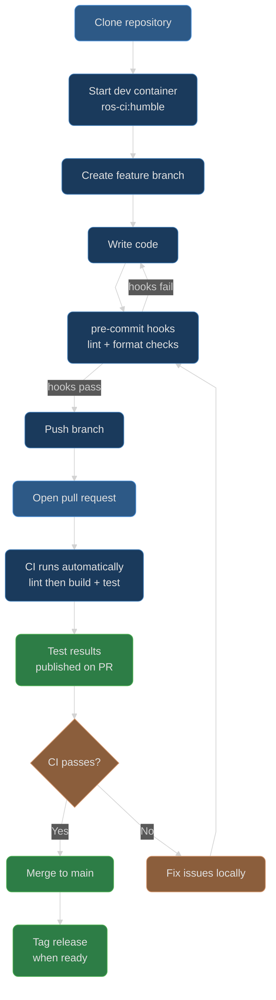

The pre-commit hooks provide the first feedback loop - catching style and formatting issues before code leaves the developer's machine. The CI pipeline provides the second - running the full lint, build, and test suite in a clean environment. This two-stage approach means developers get fast local feedback on trivial issues and only wait for the full pipeline on substantive changes.

## CI Pipeline Design

Each application repo owns its own CI workflow inline. There are no shared reusable CI workflows - each repo's pipeline is independently defined and evolvable. The shared infrastructure (Docker images, release workflow) is referenced but not imported for CI.

All pipelines enforce a sequential flow where lint gates build/test. This is a deliberate design choice: if code fails style checks, there is no value in spending compute on building and testing it. The lint job runs first and must pass before the heavier jobs begin.

### Python Repo Pipeline

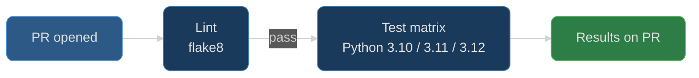

Lint runs first. If it passes, the test matrix launches three parallel jobs - one per Python version (3.10, 3.11, 3.12). Test results are published directly on the PR via `dorny/test-reporter`. The test matrix ensures the library works across the Python versions teams are likely to use.

### ROS2 Repo Pipeline

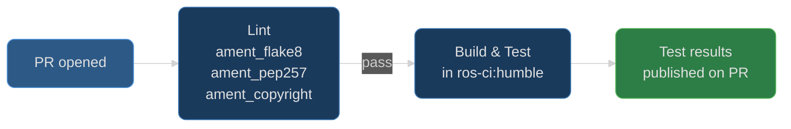

Linting uses ROS2's own ament tools (ament_flake8, ament_pep257, ament_copyright) because these are the community standard and enforce ROS2-specific conventions beyond what generic Python linters catch. Lint gates the build-and-test job - if linting fails, the PR cannot be merged regardless of test results, because style violations compound quickly across a codebase.

The build-and-test job runs inside the custom `ros-ci:humble` container, which already has vcstool, colcon, and rosdep pre-installed. It fetches pinned dependencies via vcstool from `workspace.repos`, installs system dependencies via rosdep, builds with colcon, and runs tests. Test results are uploaded as artefacts and published on the PR in a separate `report-results` job so reviewers see pass/fail status without checking logs.

## Package Release

The system uses a two-level release model that enables asynchronous development - teams release packages independently without knowing about hardware variants or other teams' schedules.

### Level 1: Package Release

When a team is ready to release, they tag their repository (e.g., `v1.0.0`). This triggers the shared `release.yaml` workflow from ci-workflows, which:

1. Checks out the ci-workflows repository to obtain `Dockerfile.release`
2. Checks out the tagged repository source as the build context
3. Builds a single Docker image for that package
4. Pushes it to GHCR (e.g., `assignment-example-ros-pkg:v1.0.0`)
5. Creates a GitHub Release with the tag, auto-generated release notes, and Docker pull instructions

The generic `Dockerfile.release` is designed to work with any ROS2 repository. Individual repos provide their source code and the shared Dockerfile handles the rest. Adding a new repo to the release pipeline requires only a thin caller workflow - no Dockerfile duplication.

Currently, `assignment_example_ros_pkg` has a release caller workflow. `assignment_example_pkg` does not yet have one because it is consumed as a source dependency via vcstool rather than as a standalone Docker image. Adding a release caller is a single-file addition when needed.

### Level 2: Product Release

The product manifest repository coordinates which package versions compose the final deployment images. When the manifest is tagged, it builds per-variant Docker images that bundle the correct packages for each hardware configuration. Each GitHub Release includes a bill of materials showing the exact package versions included in every variant. This is described in detail in [Product Manifest and Hardware Variants](#product-manifest-and-hardware-variants).

This separation is deliberate: package teams own their release cadence, and the product manifest is where those independent releases are composed into validated, deployable combinations.

## Cross-Repo Dependency Management

Dependencies between repos are managed through **vcstool** and **version pinning** in `.repos` files:

```yaml
# workspace.repos in assignment_example_ros_pkg
repositories:
  src/assignment_example_pkg:
    type: git
    url: https://github.com/calebjakemossey/assignment_example_pkg.git
    version: v1.0.0
```

vcstool is the ROS2 ecosystem standard for multi-repo workspace management, used by Nav2, MoveIt2, and Autoware. Each downstream repo pins its dependencies to specific tags, ensuring reproducible builds.

The product manifest is the authoritative source for product-level version combinations - it defines which package versions compose each hardware variant. Individual repos' `workspace.repos` files handle build-time dependencies; the manifest handles deployment-time composition.

### Version Update Flow

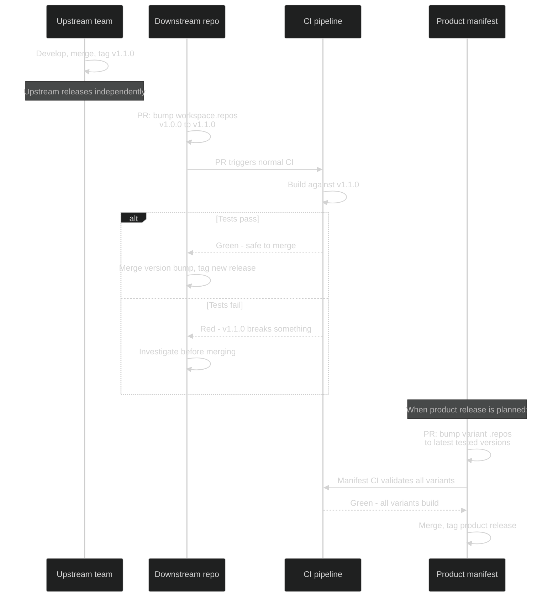

Upstream repos release independently. Downstream repos adopt new versions at their own pace via PRs that bump the version pin. Normal CI verifies compatibility - no special mechanism needed. The manifest repo then composes validated package versions into product releases.

## Product Manifest and Hardware Variants

The product manifest repository solves the coordination problem: "which combination of package versions actually works together on each hardware configuration?"

### Variant Definitions

Each hardware variant lives in its own directory under `variants/`:

```
variants/
  v1/
    manifest.repos        # Package manifest for v1 hardware
    config/               # v1-specific configuration (model weights, calibration, launch profiles)
    README.md             # v1 variant documentation
  v2/
    manifest.repos        # Package manifest for v2 hardware
    config/               # v2-specific configuration
    README.md             # v2 variant documentation
```

Each `manifest.repos` file pins every required package to a specific version, forming the complete software definition for that variant. Adding a new hardware variant is a matter of creating a new directory with a `manifest.repos` file - the CI matrix discovers it automatically.

### Validation Pipeline

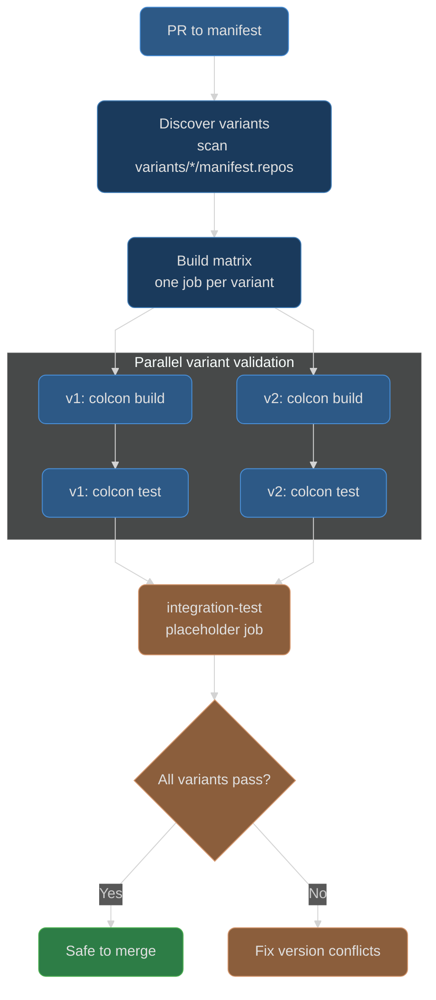

The `validate.yaml` workflow automatically discovers all variant directories (scanning `variants/*/manifest.repos`) and runs a build matrix - one job per variant. Each job fetches the packages at the pinned versions, builds the full workspace, and runs tests. The integration-test placeholder shows where end-to-end and simulation tests would slot in (see [Future Improvements](#future-improvements) for the full test pyramid).

This means every PR to the manifest proves that the proposed version combination actually builds and tests cleanly for every hardware variant before it can be merged.

### Release Pipeline

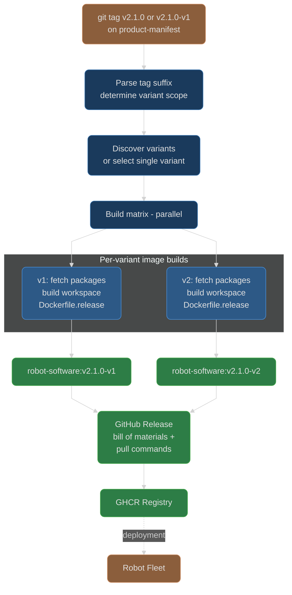

Releases are entirely tag-driven - there is no manual dispatch. The release workflow parses the tag to determine scope:

- `v2.1.0` - no suffix, builds all variants
- `v2.1.0-v1` - suffix `-v1`, builds only the v1 variant

Each image bundles exactly the packages and versions specified in that variant's `manifest.repos` file. The resulting images (e.g., `robot-software:v2.1.0-v1`, `robot-software:v2.1.0-v2`) are pushed to GHCR. A GitHub Release is created automatically, listing Docker pull commands for each variant built and a package versions table extracted from the manifests.

## Contribution Rules

Each repository includes a `CONTRIBUTING.md` with step-by-step instructions:

- [ci-workflows CONTRIBUTING.md](https://github.com/calebjakemossey/ci-workflows/blob/main/CONTRIBUTING.md)
- [assignment_example_pkg CONTRIBUTING.md](https://github.com/calebjakemossey/assignment_example_pkg/blob/main/CONTRIBUTING.md)
- [assignment_example_ros_pkg CONTRIBUTING.md](https://github.com/calebjakemossey/assignment_example_ros_pkg/blob/main/CONTRIBUTING.md)
- [product-manifest CONTRIBUTING.md](https://github.com/calebjakemossey/product-manifest/blob/main/CONTRIBUTING.md)

### PR Process Summary

1. **Clone** the repository
2. **Create a feature branch** from `main`
3. **Make changes** and run tests locally (pytest for Python, colcon build + colcon test for ROS2)
4. **Commit** - pre-commit hooks automatically check style and formatting
5. **Push** the branch and **open a PR** using the repository's PR template
6. **CI runs automatically** - lint must pass before build/test begins; test results appear directly on the PR
7. After CI passes, the PR can be merged

### Branch Protection and Review

- **Branch protection** on `main` in every repository: no force pushes, no branch deletion, strict status checks required before merge, `enforce_admins` enabled
- **CODEOWNERS** documents review ownership - in a team setting, PRs automatically request reviews from the appropriate owners
- **PR templates** provide a consistent format for describing changes, testing, and reasoning
- **Required CI checks** must pass before merge is permitted

### Pre-commit Hooks

Both application repos (`assignment_example_pkg` and `assignment_example_ros_pkg`) include `.pre-commit-config.yaml` with hooks for:

- Trailing whitespace removal
- End-of-file newline enforcement
- YAML syntax validation
- flake8 linting

These hooks run automatically on `git commit`, catching style and formatting issues before they reach CI. Developers install them once with `pre-commit install` after cloning.

## End-to-End Verification

The entire pipeline was verified with a comprehensive suite of 11 end-to-end tests covering CI pipelines, branch protection, releases, and failure detection. Every test passed.

| # | Test | Result | Verification |
|---|------|--------|--------------|
| 1 | Demo failure PR | PASS | [PR #23](https://github.com/calebjakemossey/assignment_example_ros_pkg/pull/23) - lint passes, build-and-test fails as expected. Branch protection blocks merge. |
| 2 | Branch protection | PASS | All 4 repos: force-push blocked, deletions blocked, correct status checks required, `enforce_admins` enabled. |
| 3 | Python CI happy path | PASS | [PR #17](https://github.com/calebjakemossey/assignment_example_pkg/pull/17) - lint, test (3.10/3.11/3.12) all pass, sequential flow confirmed. |
| 4 | ROS CI happy path | PASS | [PR #25](https://github.com/calebjakemossey/assignment_example_ros_pkg/pull/25) - lint, build-and-test, report-results all pass, sequential flow confirmed. |
| 5 | Manifest version bump | PASS | [PR #11](https://github.com/calebjakemossey/product-manifest/pull/11) - both variants validated (v1 + v2), integration-test pass. |
| 6 | Full product release | PASS | [Tag v1.0.0](https://github.com/calebjakemossey/product-manifest/releases/tag/v1.0.0) - both variant images built, pullable from GHCR, ROS2 packages present in images. |
| 7 | Single variant release | PASS | Tag v1.0.1-v1 - only v1 built, v2 correctly skipped. |
| 8 | Package release | PASS | Tag v1.0.1 on ros_pkg - shared workflow built single image, pullable from GHCR. |
| 9 | Docker dev workflow | PASS | `ros-ci:humble` image pulled, full build + test in container matches CI results. |
| 10 | Pre-commit hooks | PASS | Trailing whitespace and flake8 violations caught before commit. |
| 11 | Bad version bump | PASS | v1 failed on non-existent tag v99.99.99, v2 passed (unchanged). CI correctly blocks merge of invalid version bumps. |

These tests verify the complete lifecycle: local development with pre-commit hooks, CI pipelines catching both passing and failing code, branch protection enforcing status checks, package-level releases via shared workflows, product-level releases with per-variant builds, and edge case handling for invalid version references.

## Beyond the Brief

The assignment asked for a CI pipeline for two repos. This solution goes further in several areas:

### Product Manifest Repository (Challenge 3 Scope)

A fourth repository (`product-manifest`) was created to demonstrate how package releases compose into deployable products for a hybrid fleet with multiple hardware configurations. This addresses the fleet composition aspect of Challenge 3 without being explicitly required for Challenge 1.

### Two-Level Release Model

Package teams release independently via tags on their own repos (Level 1). The product manifest then coordinates which package versions run on which hardware (Level 2). This decoupling means teams ship at their own pace whilst the manifest guarantees that deployed combinations have been validated together.

### Tag-Driven Selective Variant Releases

The product manifest's release workflow parses tag suffixes to determine build scope. `v2.1.0` builds all variants; `v2.1.0-v1` builds only v1. This supports targeted hotfixes to a single hardware class without rebuilding unrelated variants.

### Auto-Discovered Variant Build Matrix

The validation and release workflows scan `variants/*/manifest.repos` to discover which variants exist. Adding a new hardware variant requires only creating a new directory - no workflow changes needed.

### GitHub Releases with Bill of Materials

Product releases automatically generate a GitHub Release listing Docker pull commands and a package versions table for each variant, extracted from the manifest files. This gives operators an at-a-glance view of exactly what is in each deployment image.

### Comprehensive E2E Test Suite

11 end-to-end tests verify the entire pipeline, from pre-commit hooks through CI, branch protection, package releases, and product releases - including deliberate failure cases and edge cases.

### Docker Development Workflow

The `ros-ci:humble` image is published to GHCR so developers can build and test locally in the same environment CI uses. This eliminates "works on my machine" discrepancies.

### Sequential CI Flow

Both repos enforce lint-then-build ordering. If code fails style checks, the pipeline stops immediately rather than wasting compute on a doomed build.

## Divergences from Assignment Requirements

| Requirement | Implementation | Reasoning |
|---|---|---|
| Private repositories | Public | GitHub's free plan does not support branch protection rules on private repos. In production, repos would be private with a paid plan. The architecture is identical either way. |
| ROS2 Iron | ROS2 Humble | The starter code referenced Iron, which reached end-of-life in December 2024. Humble is the current LTS, supported until May 2027. Building on an EOL distribution would be inappropriate for a production pipeline. |
| Required PR approvals | CI checks only | A solo developer cannot approve their own PRs on GitHub - the platform prevents it. The review process is fully documented in CODEOWNERS and CONTRIBUTING.md and would activate immediately in a team setting. |

## Future Improvements

The implemented solution covers the assignment scope with four repositories. This section describes how the architecture scales for a production robotics organisation with many repos, teams, and hardware targets.

### Automated Version Bumps

The current product manifest requires manual PRs to bump package versions. At scale, automated tooling would watch upstream repos for new tags and open version bump PRs automatically. This could auto-merge non-breaking updates (patch versions) whilst requiring manual review for major or minor bumps. The goal is to reduce coordination overhead so teams genuinely release independently without the manifest becoming a bottleneck.

### Test Pyramid at Manifest Level

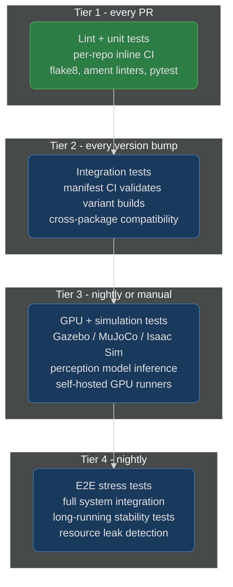

Tier 1 is what the current implementation provides - fast lint and unit tests on every PR. Tier 2 is partially implemented via the manifest's `validate.yaml` build matrix. Tiers 3 and 4 represent the integration-test placeholder's intended evolution: simulation tests on GPU runners and overnight stress tests that catch issues only visible under sustained load. Each tier gates the next - code must pass cheaper tests before consuming expensive resources.

### Dev/Stable Branching

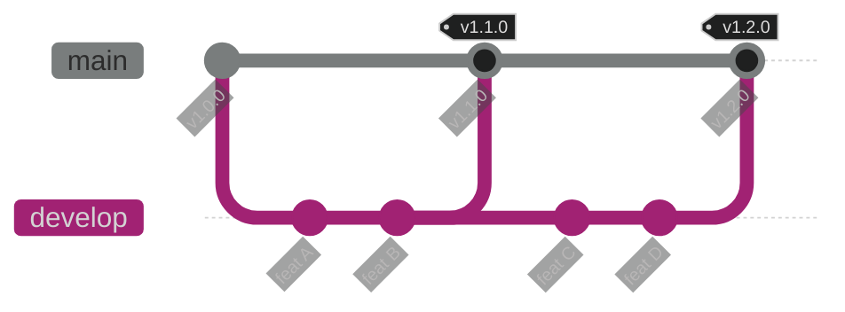

The current implementation uses trunk-based development (main only), which is appropriate for a small team. A `develop` branch becomes valuable when 3+ developers are merging daily - it acts as an integration buffer where features land together and are tested before promotion to `main`. Main stays deployable at all times. The manifest repo would pin to main tags for stable builds and optionally track `develop` for early integration testing.

### Production Infrastructure

The current solution uses GitHub-hosted runners and GHCR - zero infrastructure to manage, which is appropriate for proving the pipeline works. In production, the architecture moves to private, self-managed infrastructure where every service has a clear role and the entire system is hidden behind a VPC.

#### Runner Architecture

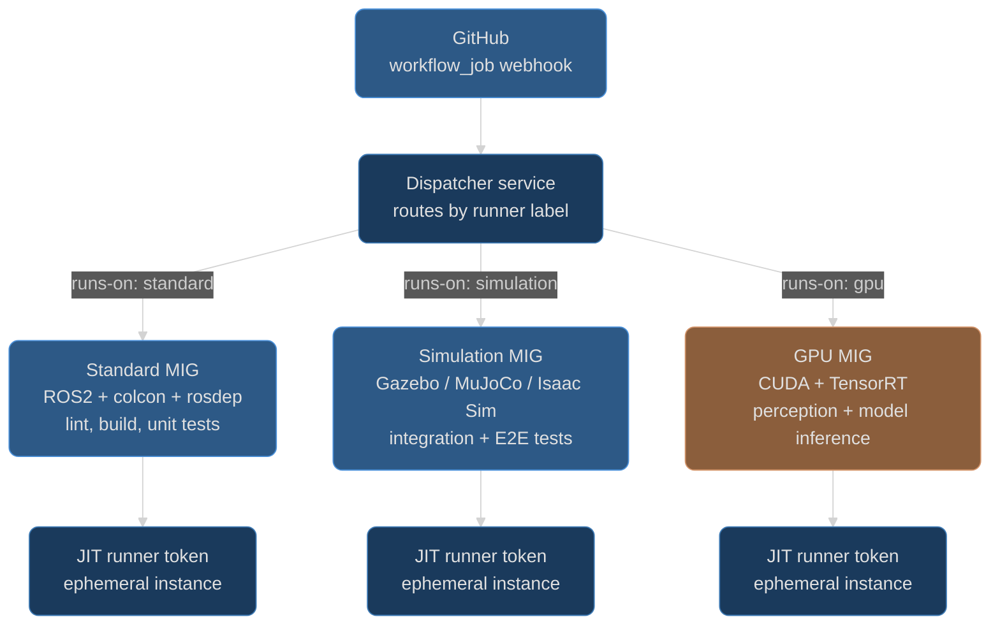

The current Docker-based approach (pulling `ros-ci:humble` on each run) is a stepping stone. The production target is **purpose-built ephemeral runners** where the build environment is baked into the machine image rather than pulled as a container:

- Runner images are built with **Packer**, with ROS2, colcon, rosdep, and all build tooling pre-installed - **eliminating the need for a CI Docker container entirely**. Packages build and test directly on the runner, the same way a developer would on their local machine.
- Each runner family is a **Managed Instance Group (MIG)** on GCP (or Auto Scaling Group on AWS) with different machine specs and base images. A **standard runner** has ROS2 and build tools for CI. A **simulation runner** adds Gazebo, MuJoCo, or Isaac Sim. A **GPU runner** has CUDA, TensorRT, and model inference tooling.
- A lightweight **dispatcher service** receives GitHub `workflow_job` webhooks and routes each job to the correct MIG based on the `runs-on` label. The MIG scales up, provisions an ephemeral instance using GitHub's **just-in-time (JIT) runner token**, the job runs, and the instance is torn down. Runners only exist while jobs are running - zero idle cost.
- This removes a layer of abstraction, gives direct access to hardware (GPUs, sensors, real-time kernel), and is significantly faster than pulling a container on every run.
- On-premise GPU hardware is preferred where available due to cloud GPU cost and availability constraints. The MIG pattern works identically with on-premise hypervisors.

**Why this is more optimal:** Every CI job currently spends time pulling and starting a Docker container. With pre-baked runners, that overhead disappears. GPU workloads in particular cannot run efficiently in containers - CUDA initialisation, model loading, and Gazebo rendering all perform better with direct hardware access. The MIG autoscaling pattern means infrastructure cost scales linearly with actual CI usage rather than paying for idle capacity.

#### Cloud Architecture

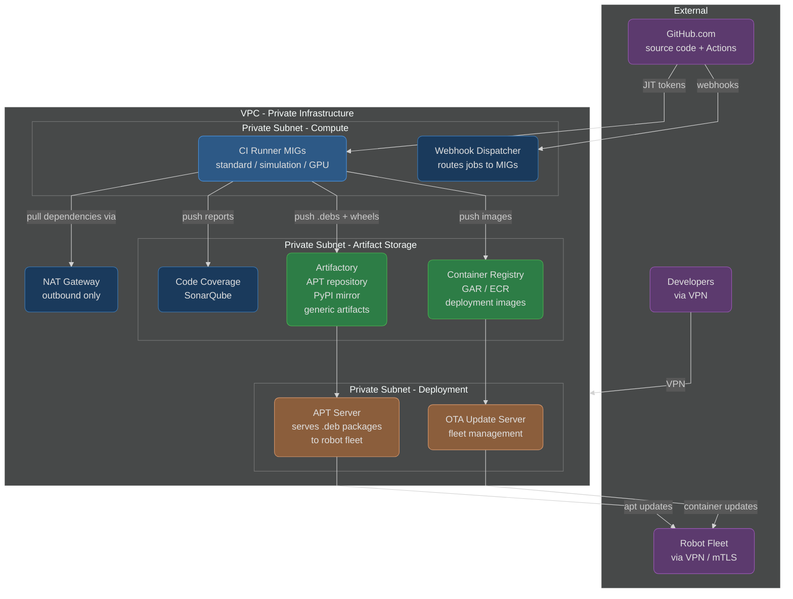

The entire CI/CD infrastructure lives inside a **VPC** with no public ingress. GitHub communicates inbound via webhooks to the dispatcher service (the only endpoint exposed, behind a load balancer with IP allowlisting for GitHub's webhook ranges). All other services - runners, registries, coverage servers, deployment infrastructure - sit in private subnets accessible only via VPN.

**Why a VPC matters:** Robotics software often contains proprietary algorithms, trained models, and hardware-specific calibration data. None of this should be accessible from the public internet. The current public GHCR setup is appropriate for a demo but would be replaced by private infrastructure in production.

Each service has a specific role:

- **NAT Gateway** - outbound-only access for pulling upstream dependencies (ROS apt repos, PyPI, Docker Hub base images). No inbound access from the internet to compute or storage resources.
- **Container Registry (GAR/ECR)** - cloud-native container registry for deployment images. Replaces GHCR. Sits in the same cloud region as the runners for fast pushes, and in the same network as the deployment infrastructure for fast pulls. Cloud-native registries integrate with IAM, vulnerability scanning, and image signing out of the box.
- **Artifactory** - handles everything that is not a container image: .deb packages for robots, Python wheels for internal libraries, generic artifacts like model weights and calibration files. Also acts as a **proxy cache** in front of upstream repositories (PyPI, ROS apt, Docker Hub) - all dependency fetches route through Artifactory, giving a single audit point, caching for faster builds, and protection against upstream outages.
- **Code Coverage / SonarQube** - self-hosted static analysis and coverage tracking. Coverage reports are posted on PRs, coverage gates enforce minimum thresholds, and trend dashboards show quality metrics over time. Self-hosted because coverage data contains the full source structure - it should not leave the VPC.
- **OTA Update Server** - manages which robots run which software version. Pulls deployment images from GAR and orchestrates rolling updates across the fleet. Tracks deployment state per robot.
- **APT Server** - serves .deb packages to robots that run Ubuntu natively rather than containers. Backed by Artifactory's APT repository.

#### Artifact Promotion Pipeline

Not all artifacts are equal. A build that passes unit tests is not necessarily ready for production. The artifact promotion model creates gates between environments:

```
dev (CI passes) → staging (integration tests pass) → production (acceptance tests pass)
```

- **dev channel** - every artifact that passes CI lands here automatically. Internal testing and development pull from this channel.
- **staging channel** - artifacts that pass the full integration test suite (Tier 2 + Tier 3 from the test pyramid) are promoted here. Pre-production robots and QA environments pull from staging.
- **production channel** - artifacts that pass acceptance testing and manual approval are promoted to production. The robot fleet only ever pulls from this channel.

This applies to both container images (promoted between GAR tags/channels) and .deb packages (promoted between Artifactory APT repositories). The product manifest would reference the production channel, ensuring that tagged releases only ever compose artifacts that have been fully validated.

**Why promotion matters:** Without it, a CI-passing artifact goes straight to robots. With it, there are multiple verification stages, and a bad build is caught before it reaches the fleet. Rollback is straightforward - point the fleet back to the previous production channel version.

#### Debian Packaging as an Alternative to Containers

Containers are not always the right deployment model for robots. Resource-constrained hardware, real-time kernel requirements, or direct sensor access may rule out Docker. In these cases, the same CI pipeline produces **.deb packages** instead of (or alongside) container images:

1. `colcon build` produces a ROS2 install space (same as today)
2. **bloom-generate** creates Debian packaging metadata from `package.xml` - bloom is the ROS ecosystem standard for this
3. CI builds the `.deb`, uploads it to Artifactory's APT repository
4. Each hardware variant has its own **APT sources list** pinning exact package versions - the same concept as the current `manifest.repos` but for Debian packages
5. Robots pull updates via `apt update && apt upgrade` against the private APT server
6. Version pinning via `apt preferences` or a variant-specific manifest ensures each robot class gets exactly the right package versions

The product manifest concept translates directly: instead of `manifest.repos` → Docker image per variant, it becomes an APT sources list → pinned .deb versions per variant. The coordination layer (which versions go on which hardware) remains the same regardless of the delivery mechanism.

**Why .debs alongside containers:** Different robots in the fleet may have different deployment needs. A powerful compute unit might run containerised workloads. A lightweight controller board might need .debs installed directly on the OS. Supporting both from the same CI pipeline means the build system does not constrain the deployment model.

### Code Coverage and Quality Tooling

The current implementation enforces linting (flake8, ament linters) and runs tests with pass/fail reporting. Production-grade quality tooling adds measurement and trend tracking:

- **pytest-cov** for Python coverage, **lcov/gcov** for C++ packages - both generate reports showing which lines and branches are exercised by tests
- **Coverage gates** on PRs - enforce a minimum threshold (e.g. 80%) before merge, with **ratcheting** so coverage can only go up (new code must be tested, existing coverage cannot regress)
- **SonarQube** (self-hosted, inside the VPC) for static analysis beyond linting - code smells, security hotspots, complexity metrics, duplication detection
- **Coverage trend dashboards** showing quality metrics per package over time - makes it visible when test coverage is declining before it becomes a problem
- **Vulnerability scanning** on dependencies and container images - integrated into Artifactory (scans on ingest) and the container registry (scans on push)
- **Licence compliance** checks to ensure all dependencies across the workspace have compatible licences - critical for robotics companies shipping proprietary software that bundles open-source dependencies

**Why self-hosted quality tooling:** Coverage reports and static analysis results contain the full source structure and can reveal proprietary logic. Hosting SonarQube inside the VPC keeps this data private whilst still providing the PR-level feedback that developers need.

### vcstool Limitations

vcstool is the right tool for this scope, but it has known limitations at scale:

- **No dependency resolution** - it is a straightforward fetcher, not a package manager. It does not understand that package A depends on package B
- **No version constraints** - pins are to exact tags or SHAs only. There is no way to express ">=1.2.0, <2.0.0"
- **No conflict detection** across multiple `.repos` files - if two files pin the same repo to different versions, the last one wins silently
- **No lock file mechanism** - reproducibility depends entirely on using exact SHAs rather than branch names

Organisations at scale typically build custom tooling on top of vcstool to address these gaps, or migrate to more sophisticated dependency management approaches.

## Pipeline Links

| Description | Link |
|---|---|
| ci-workflows Actions | [View](https://github.com/calebjakemossey/ci-workflows/actions) |
| assignment_example_pkg Actions | [View](https://github.com/calebjakemossey/assignment_example_pkg/actions) |
| assignment_example_ros_pkg Actions | [View](https://github.com/calebjakemossey/assignment_example_ros_pkg/actions) |
| product-manifest Actions | [View](https://github.com/calebjakemossey/product-manifest/actions) |
| Demo failing PR (CI catches regression) | [PR #23](https://github.com/calebjakemossey/assignment_example_ros_pkg/pull/23) |
| Python CI happy path | [PR #17](https://github.com/calebjakemossey/assignment_example_pkg/pull/17) |
| ROS CI happy path | [PR #25](https://github.com/calebjakemossey/assignment_example_ros_pkg/pull/25) |
| Manifest version bump | [PR #11](https://github.com/calebjakemossey/product-manifest/pull/11) |
| Product release (all variants) | [v1.0.0](https://github.com/calebjakemossey/product-manifest/releases/tag/v1.0.0) |
| CI Docker image (GHCR) | [ros-ci](https://github.com/calebjakemossey/ci-workflows/pkgs/container/ros-ci) |
